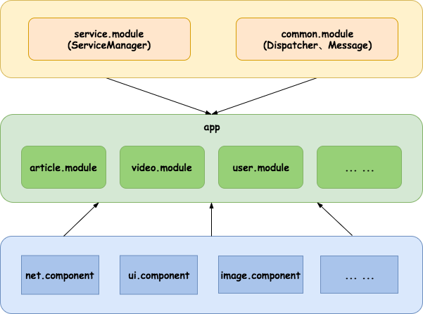
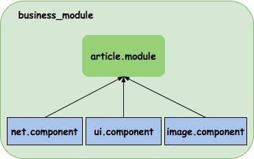

### 整体设计

但是为了保证编译通过，我们还是要依赖 service.module，common.module，实际上并未使用其他module功能

### 项目粒度划分

- *.module : 业务模块
- *.component ：功能组件

### 组件化思路：
1. 公有 功能(技术) 组件，按需提供给各个业务模块，业务模块相互隔离
2. 发送消息（Messager）、跳转能力（router、dispatcher）、服务提供能力（ServiceProvider）、公有obj( 或者传输：TO )
3. Debug / Release 期间，动态切换，app module — business module互转，主工程壳子:app

### 跨module通信：
1. 服务注册

**服务提供方**来定义所需接口内容，包括：功能 和 方法
(告知对方，我需要什么功能)

2. 服务获取

**服务提供方**来实现具体功能，仅仅暴露接口方法，其 实现类不暴露
(返回执行结果，不让其知道别的细节，做到隔离)

3. 模式切换
* debug: 每个 业务module可单独运行, 相关的接口依赖可以作为 compileOnly
* release: 每个 业务module 转换成 lib

### Dispatcher、Router
各自的业务模块自己来注册，外界只管跳转

### 后期
定制Android Studio 开发模板，定制开发目录

### 编译
* 集成编译(devmode = false)
    * **./gradlew assembleDebug --offline**
    * **./gradlew assembleRelease --offline**

* 单独编译(devmode = true)
    * **./gradlew :article.module:assembleDebug --offline**
    * **./gradlew :article.module:assembleRelease --offline**
    * 其他类似....

### 其他
studio 有时候不识别manifest中的类，需rebuild/sync下

参考：
https://mp.weixin.qq.com/s/6Q818XA5FaHd7jJMFBG60w
http://www.cnblogs.com/LBSer/p/4853234.html
Android bindService、AIDL

组件化资料：
https://juejin.im/entry/58d48a3ca22b9d00645378a7
https://www.google.com.hk/search?q=%E7%BB%84%E4%BB%B6%E5%8C%96+android&oq=%E7%BB%84%E4%BB%B6%E5%8C%96&aqs=chrome.5.69i57j69i61j69i65j69i61j0l2.4796j0j1&sourceid=chrome&ie=UTF-8